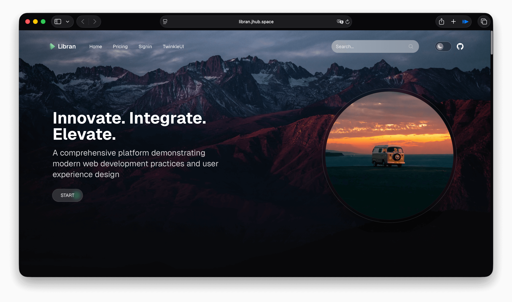
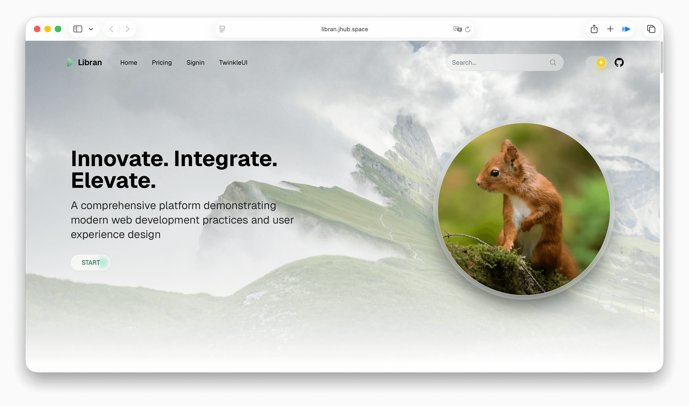
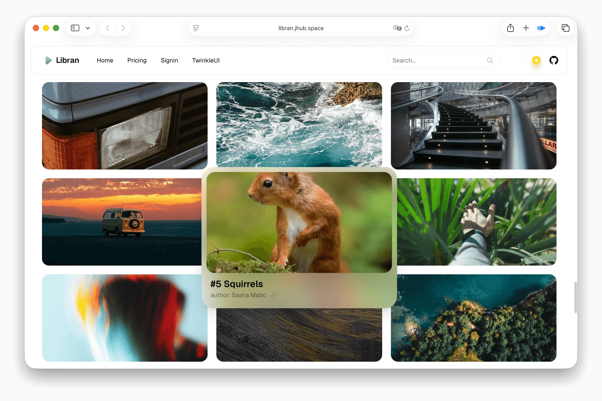

# Libran

A website example developed with [TwinkleUI](https://twinkleui.vercel.app), built on Next.js, offering an elegant user interface and smooth interactive experience.





## ✨ Features

- Built with Next.js 15+ using App Router
- Responsive design, adapting to various device sizes
- Rich animation effects implemented with Motion
- Dark mode switching support
- Modular component design, easy to extend and maintain
- Style management with Tailwind CSS
- Optimized performance and loading speed

## 🛠️ Technology Stack

- **Framework**: Next.js 15+
- **Language**: TypeScript
- **Styling**: Tailwind CSS
- **Animation**: Motion

## 🚀 Quick Start

### Prerequisites

- Node.js 18+
- npm/yarn/pnpm/bun

### Installation

```bash
# Clone the project
git clone https://github.com/jianhuagao/Libran
cd Libran

# Install dependencies
npm install
# or
yarn install
# or
pnpm install
# or
bun install
```

### Run Development Server

```bash
npm run dev
# or
yarn dev
# or
pnpm dev
# or
bun dev
```

Open [http://localhost:3000](http://localhost:3000) to view the result.

## 🌐 Deployment

### Vercel Deployment

1. Install Vercel CLI:

```bash
npm install -g vercel
```

2. Login and deploy:

```bash
vercel login
vercel
```

### Other Deployment Methods

Please refer to the [Next.js Deployment Documentation](https://nextjs.org/docs/app/building-your-application/deploying).

## 🤝 Contribution

Contributions, issues, and feature requests are welcome!

## 📄 License

This project is licensed under the [MIT License](LICENSE).
